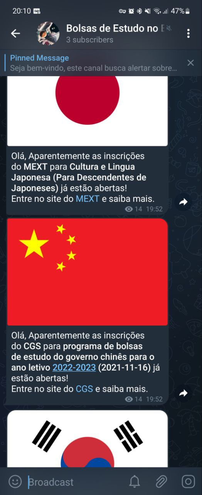

# International Scholarships Alert

Host yourself or check out my <a href="https://t.me/+LUWAZNQoHSs0MTBh">Telegram</a> channel.

This is a really simple AWS lambda function that alerts information about scholarships from embassies and consulates in Brazil through email and telegra.

If you liked this you might like [this repo](https://github.com/Daniel-EST/bolsas-de-estudo-para-brasileiros) that has some information about international scholarships worldwide that I gathered while during my research.

Countries currently available:
- China
- Japan
- Korea

### Don't rely 100% on this bot.

## Bot in action

# How to use

- Create a new email to send those messages;
- Install dependencies in the same folder, by running:  
`pip install -r requirements -t .`

- Then Zip everything
- Configure AWS Lamnbda and upload there
- Configure CloudWatch

#### OBS.: You can create a cronjob at your local machine too

# Enviroment variables

- EMAIL=Sender email  
- EMAIL_PASSWORD=Sender password  
- EMAIL_RECEIVER_1=Recipient email  
- EMAIL_RECEIVER_2=Another recipient email 
- TELEGRAM_KEY=Telegram's bot auth key
- TELEGRAM_CHAT_ID=Telegram's chat id

# TODO:
- Add more embassies and consulates
- Email database
- Front-end for email register
- Huge refactor (code is currently really bad. tbh it's kinda embarrassing)
